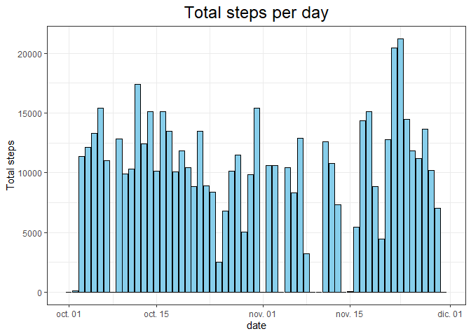
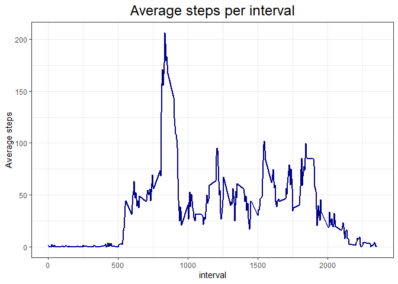
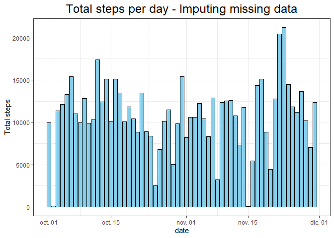
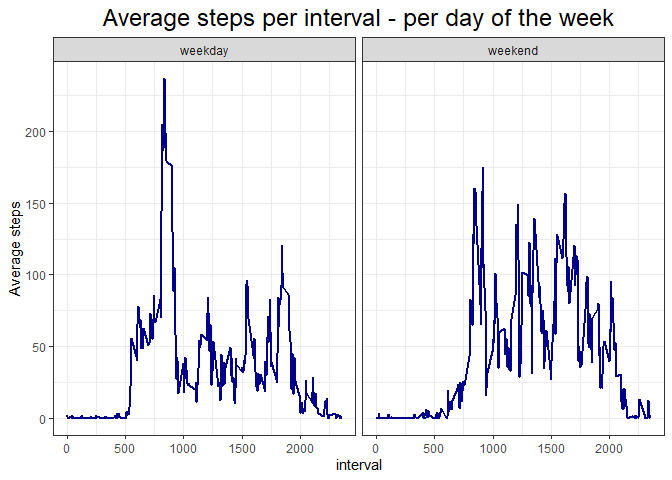

## Loading and preprocessing the data


```r
data <- read.csv("C:/Users/Uninorte/Dropbox/RESUMEN CURSOS/COURSERA/Reproducible Research/WEEK2/1st project/activity.csv")
data$date <- as_datetime(data$date)
glimpse(data)
```

```
## Rows: 17,568
## Columns: 3
## $ steps    <int> NA, NA, NA, NA, NA, NA, NA, NA, NA, NA, NA, NA, NA, NA, NA, N~
## $ date     <dttm> 2012-10-01, 2012-10-01, 2012-10-01, 2012-10-01, 2012-10-01, ~
## $ interval <int> 0, 5, 10, 15, 20, 25, 30, 35, 40, 45, 50, 55, 100, 105, 110, ~
```


## What is mean total number of steps taken per day?

I will group by the dates and sum all the steps values omitting the missing values


```r
total_steps <- data %>% group_by(date) %>% summarise(steps_day=sum(steps, na.rm = TRUE))
head(arrange(total_steps, desc(steps_day)),10)
```

```
## # A tibble: 10 x 2
##    date                steps_day
##    <dttm>                  <int>
##  1 2012-11-23 00:00:00     21194
##  2 2012-11-22 00:00:00     20427
##  3 2012-10-12 00:00:00     17382
##  4 2012-10-06 00:00:00     15420
##  5 2012-10-31 00:00:00     15414
##  6 2012-11-18 00:00:00     15110
##  7 2012-10-14 00:00:00     15098
##  8 2012-10-16 00:00:00     15084
##  9 2012-11-24 00:00:00     14478
## 10 2012-11-17 00:00:00     14339
```

```r
total_steps %>% ggplot(aes(x=date,y=steps_day)) + geom_bar(color="black",
                                            stat = "identity",fill="skyblue")+
      ylab("Total steps")+ggtitle("Total steps per day")+theme_bw()+
      theme(plot.title =  element_text(hjust=0.5,size=18))
```

<!-- -->

#### **Mean - omitting missing values**

```r
mean(total_steps$steps_day)
```

```
## [1] 9354.23
```

#### **Median - omitting missing values**

```r
median(total_steps$steps_day)
```

```
## [1] 10395
```


## What is the average daily activity pattern?

```r
daily_pattern <- data %>% group_by(interval) %>% summarise(avg=mean(steps, na.rm = TRUE))
daily_pattern %>% ggplot(aes(x=interval,y=avg))+geom_line(size=0.8, color="darkblue")+theme_bw()+
      ylab("Average steps")+ggtitle("Average steps per interval")+
      theme(plot.title =  element_text(hjust=0.5,size=18))
```

<!-- -->


```r
head(arrange(daily_pattern, desc(avg)),20)
```

```
## # A tibble: 20 x 2
##    interval   avg
##       <int> <dbl>
##  1      835 206. 
##  2      840 196. 
##  3      850 183. 
##  4      845 180. 
##  5      830 177. 
##  6      820 171. 
##  7      855 167. 
##  8      815 158. 
##  9      825 155. 
## 10      900 143. 
## 11      810 129. 
## 12      905 124. 
## 13      910 109. 
## 14      915 108. 
## 15      920 104. 
## 16     1550 102. 
## 17     1845  99.5
## 18     1545  98.7
## 19      925  96.0
## 20     1210  94.8
```

**The interval 835 has the maximum average steps across all the days**

## Imputing missing values

```r
sum(is.na(data$steps)) #2304 missing steps values
```

```
## [1] 2304
```

```r
sum(is.na(data$date))
```

```
## [1] 0
```

```r
sum(is.na(data$interval))
```

```
## [1] 0
```

The dataset has 2304 missing steps values.

I will impute the NA's with the average value for the specific time interval, in the specific week day. For example, a NA value for a Thursday at interval 720, will have the average value of all the  Thursday at interval 720.


```r
data$week_day <- weekdays(data$date)
data_for_imputing <- data %>% group_by(week_day,interval) %>% summarise(avg=round(mean(steps, na.rm = TRUE),0))
```

```
## `summarise()` has grouped output by 'week_day'. You can override using the
## `.groups` argument.
```

```r
missing <- data %>% filter(is.na(steps)) %>%
      left_join(data_for_imputing, by=c("week_day","interval")) %>% 
      mutate(steps=avg) %>% select(1:4)

missing$steps <- as.integer(missing$steps)
sum(is.na(missing$steps))
```

```
## [1] 0
```
The new dataset wouldnt have any missing value:


```r
data <- data %>% filter(!is.na(steps))
data <- rbind(data,missing)
data <- arrange(data, date)
data[sample(1:nrow(data))[1:10],]
```

```
##       steps       date interval week_day
## 4133     75 2012-10-15      820    lunes
## 12208   536 2012-11-12      915    lunes
## 9710      0 2012-11-03     1705   sábado
## 9937    125 2012-11-04     1200  domingo
## 12510   153 2012-11-13     1025   martes
## 14657     0 2012-11-20     2120   martes
## 4923      0 2012-10-18      210   jueves
## 9640      0 2012-11-03     1115   sábado
## 5928    309 2012-10-21     1355  domingo
## 1160      0 2012-10-05       35  viernes
```
And now, the total steps per day without missing values will looks like this:


```r
total_steps2 <- data %>% group_by(date) %>% summarise(steps_day=sum(steps, na.rm = TRUE))
head(arrange(total_steps2, desc(steps_day)),10)
```

```
## # A tibble: 10 x 2
##    date                steps_day
##    <dttm>                  <int>
##  1 2012-11-23 00:00:00     21194
##  2 2012-11-22 00:00:00     20427
##  3 2012-10-12 00:00:00     17382
##  4 2012-10-06 00:00:00     15420
##  5 2012-10-31 00:00:00     15414
##  6 2012-11-18 00:00:00     15110
##  7 2012-10-14 00:00:00     15098
##  8 2012-10-16 00:00:00     15084
##  9 2012-11-24 00:00:00     14478
## 10 2012-11-17 00:00:00     14339
```

```r
total_steps2 %>% ggplot(aes(x=date,y=steps_day)) + geom_bar(color="black",
                                                           stat = "identity",fill="skyblue")+
      ylab("Total steps")+ggtitle("Total steps per day - Imputing missing data")+theme_bw()+
      theme(plot.title =  element_text(hjust=0.5,size=18))
```

<!-- -->


#### **Mean - imputing the missing values**

```r
mean(total_steps2$steps_day)
```

```
## [1] 10821.1
```

#### **Median - imputing the missing values**

```r
median(total_steps2$steps_day)
```

```
## [1] 11015
```


## Are there differences in activity patterns between weekdays and weekends?

```r
set.seed(2)
data$date_type <- if_else(data$week_day %in% c("sábado","domingo"), "weekend","weekday")
data[sample(1:nrow(data))[1:10],]
```

```
##       steps       date interval  week_day date_type
## 12117     0 2012-11-12      140     lunes   weekday
## 13263     0 2012-11-16      110   viernes   weekday
## 4806      0 2012-10-17     1625 miércoles   weekday
## 11014     0 2012-11-08      545    jueves   weekday
## 8465      0 2012-10-30      920    martes   weekday
## 3276    748 2012-10-12      855   viernes   weekday
## 3453      0 2012-10-12     2340   viernes   weekday
## 15657   139 2012-11-24      840    sábado   weekend
## 17074     0 2012-11-29      645    jueves   weekday
## 11851     0 2012-11-11      330   domingo   weekend
```


```r
daily_pattern2 <- data %>% group_by(interval,date_type) %>% summarise(avg=mean(steps))
```

```
## `summarise()` has grouped output by 'interval'. You can override using the
## `.groups` argument.
```

```r
daily_pattern2 %>% ggplot(aes(x=interval,y=avg))+geom_line(size=0.8, color="darkblue")+theme_bw()+
      ylab("Average steps")+ggtitle("Average steps per interval - per day of the week")+
      theme(plot.title =  element_text(hjust=0.5,size=18))+facet_wrap("date_type")
```

<!-- -->

Yes, there is a 


